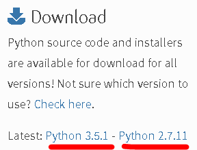
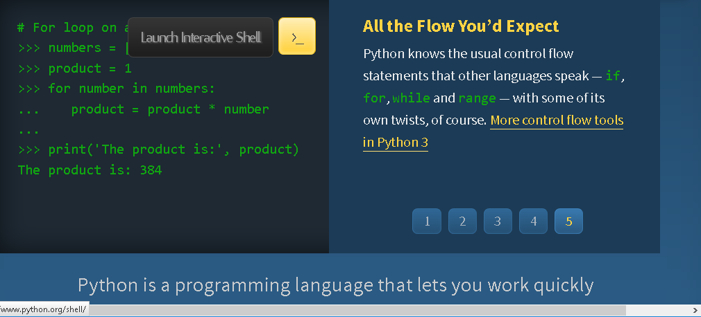
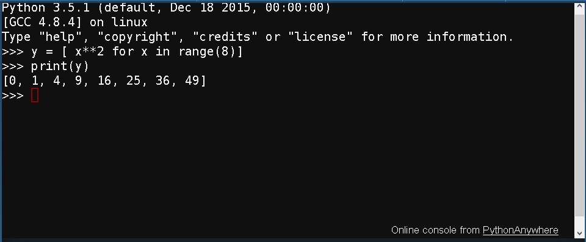

# Dicas de instalação e configuração (o que, e por quê)

A primeira dúvida que costuma surgir aos iniciantes no universo Python é: qual versão do Python instalar?!

Sim, esta dúvida é procedente uma vez que, mesmo após o lançamento da versão 3 do Python, a versão 2.7 continuou sendo mantida e atualizada.
Atualmente ambas versões estão disponíveis para download no site [Python Software Foundation]( https://www.python.org/)



Então, qual escolher?!

Sem dúvida alguma a última versão traz inúmeros benefícios e melhorias, vale a pena entrar no site mencionado anteriormente para conferir, porém, existem muitos módulos Python que foram desenvolvidos pela comunidade e que não foram ainda migrados para a última versão. Este número é tão expressivo que a dúvida na escolha da versão é uma questão recorrente que ainda persiste!

*Hoje, para quem quer brincar com análises de dados ou computação científica, “deve” optar pela última atualização da versão 2.7. Esta é (hoje-2016) a versão que a comunidade científica mais vem adotando para estudos, desenvolvimentos, etc., justamente pelos motivos já mencionados.*

Leste o parágrafo acima? Desculpa, mas achei importante deixá-lo como registro - sim, isso foi dito em 2016, quando iniciei escrever este livro, mas como me tornei papai, desde então o livro está praticamente parado, até agora (2019) quando pretendo ir retomando aos poucos. Agora, sobre esta questão da versão, é preciso enfatizar que já está definida a data para o fim ao suporte da versão 2.7 do Python (janeiro/2020), apesar disso, ainda tem alguma coisa que só existe para esta versão, então a escolha vai depeder muito do que pretendes fazer.

Minha recomendação (em 2019) é instalar o **Python 3.7** ou superior, no caso de precisar alguma coisa da versão 2.7, ainda poderás utilizar os recursos de *virtualenv* do Python!

OK – uma vez escolhida a versão basta baixar o Python e instalar?

Não, ou melhor, sim, caso queiras ter um bom trabalho instalando mais um monte de “coisas úteis” que, em geral, um Engenheiro precisa. 

Nós recomendamos instalar o [Anaconda]( https://www.anaconda.com ) - *sim, em 2016 Anaconda era apenas a distribuição da continuum, de 2016 à 2018 o nome anaconda ficou tão forte que passou a ser a nova marca registrada!*

Sei que alguns novatos vão achar engraçado trocar uma “serpente” por outra, mas este não é o caso. O Anaconda que nos referimos nada mais é do que uma plataforma para computação científica que inclui o Python, ou seja, além de instalar o Python, já instala e configura um monte de outros recursos e módulos que aceleram o processo de “montagem” de um ambiente científico e de análises.

Então baixe a última versão do Anaconda (que utiliza o Python 3.7) e instale! Ao final, muitos dos módulos e recursos que abordaremos neste material já estarão disponíveis e prontos para utilização!

Uma vez instalado o Python, é possível abrir algum dos seus IDE’s (pesquisar na *WWW*, o IDLE em geral vem junto com algumas instalações) e executar diretamente alguns comandos nele.

Quem não instalou ainda e mesmo assim quer brincar agora, é possível executar comandos diretamente no ambiente disponibilizado no site [Python Software Foundation]( https://www.python.org/). Para tanto, basta selecionar a opção: *Launch Interactive Shell*



Vamos iniciar com um probleminha simples: criar uma lista com 8 elementos contendo a avaliação da parábola $$x^2$$ para os valores inteiros de 0 a 7, inclusive. Para tanto, basta executar a seguinte linha de comando:
```
y = [ x**2 for x in range(8)]
print(y)
```
Para aqueles que usaram o próprio site sugerido para executar os comandos acima, o resultado deve ser este:



A primeira linha cria uma lista (estrutura de dados a ser vista mais adiante) através da função *range()* em um laço ***for*** com a avaliação dos valores de 0 a 7, inclusive, em uma função que eleva elemento a elemento ao quadrado através do operador de potência $$**$$. O resultado é atribuído à variável $$y$$ e posteriormente mostrado na tela através da função *print()*.

>**Nota:**
>Sim, respondendo aos mais observadores e ousados, as listas são estruturas de dados representadas entre colhectes **[ ]** com os elementos (qualquer coisa) separados por vírgulas **,** , simples, não?!
>Ah! E sim também para o operador de potenciação que é representado por dois asteriscos $$**$$ , e não pelo acento circunflexo como em algumas linguagens.

Para quem prefere brincar com *strings*, vale experimentar este exemplo e ver o resultado:
```
s = [ “a_” + str(i) for i in range(10)]
print(s)
```

Neste exemplo utilizamos a função *str()* que converte dados numéricos em *strings* (“formato texto”). Notar que as *strings* em Python podem ser representadas entre aspas duplas **" "**, ou aspas simples **' '**.

E, para aqueles que preferem trabalhar com datas e horas, olha que fácil:
```
import datetime as dt
dia = [dt.datetime(2016, 6, 6) + dt.timedelta(days=i) for i in range(3)]
print(dia)
```
Neste caso importamos o módulo ***datetime***, que nada mais é que uma biblioteca nativa do Python para trabalhar com dados do tipo “data-hora”. A seguir veremos um pouco mais sobre os módulos e como utilizá-los nos nossos scripts/programas/análises, mas já fica a dica, é através do comando ***import***, óbvio, não?!

## Um pouco a mais...

Bem, como dissemos anteriormente, o Anaconda facilita muito o processo de instalação de um conjunto de ferramentas para computação científica, como os módulos matemáticos e gráficos, o ambiente científico (aplicativo) [Spyder](http://pythonhosted.org/spyder/), o sensacional [Jupyter Notebook](http://jupyter.org/) - excelente ambiente para análises, registro do memorial de cálculos, utilização para fins didáticos, etc...etc...etc... - dentre inúmeras outras ferramentas que veremos ao longo deste material.

Dito tudo isso, ainda resta dizer: tem sim um pouco mais... aliás, quando se trata de Python, sempre tem um pouco mais - um pouco mais do mesmo e um pouco mais de coisas diferentes e até mesmo inusitadas! Então vamos a mais alguns aplicativos que sugiro fortemente pesquisarem um pouco mais, claro que esta é a dica para os ousados (que são exatamente os que chegaram até este ponto da leitura)!


### [Atom]( https://atom.io/)
É um editor de texto que roda em **Linux, Mac e Windows** - além de um visual moderno e inúmeras ferramentas interessantes que facilitam e aceleram o processo de desenvolvimento de scripts em Python, suporta inúmeros plugins direcionados especificamente para esta linguagem.

### [Sublime]( https://www.sublimetext.com/)
Equivalente ao Atom, porém muito mais rápido para carregar, é outra alternativa de editor de texto multiplataforma bastante difundido.

### [VIM]( https://www.vim.org/)
Este é para os ousados - realmente não poderás ser considerado um "bom programador", o engenheiro que não não **preferir usar** o VIM para escrever seus códigos. Brincadeiras à parte, realmente este é o melhor de todos os editores de texto, uma curva de aprendizagem um pouco lenta, mas com ganhos de produtividade, alegria e prazer indescritíveis - vale a pena pesquisar um pouco mais e "dar uma chance" ao VIM - hoje eu só uso ele, para tudo, inclusive para escrever este livro (com direito à corretor ortográfico e tudo mais).

### [Eclipse](https://eclipse.org/)
Também pode ser utilizado apenas como um editor de textos, porém é muito mais que isso, é um ambiente projetado para o desenvolvimento de software, suportando inúmeras linguagens - dentre elas: Python, é claro, através do plugin **[PyDev](http://www.pydev.org/)**.

Roda em **Linux, Mac e Windows**, disponibilizando um excelente ambiente para depuração de código Python, muito útil principalmente em grandes projetos.

Dentre as funcionalidades de depuração, vale destacar a possibilidade de depurar um código Python que está sendo avaliado por um outro programa (processo) - caso típico de *debugging attached to process* - comum em aplicativos que usam o Python como linguagem de script (ex.: [Libre Office](https://www.libreoffice.org/), [FreeCad](http://www.freecadweb.org/), etc.) e/ou para desenvolvimento de plugins (ex.: [Gimp](https://www.gimp.org/), [Inkscape](https://inkscape.org/en/), [Blender](https://www.blender.org/), [QGis](http://www.qgis.org/), etc.)!

### [PyCharm](https://www.jetbrains.com/pycharm/)
Similarmente ao Eclipse, o PyCharme também é um IDE, porém feito para o Python, disponibilizando ferramentas equivalentes ao Eclipse em termos de depuração de código. Para os que gostam do VIM, tem um plugin que emula seus comandos na área do editor do PyCharm.

Roda em **Linux, Mac e Windows**, para usar *free*, deve-se optar pela versão *Community*.

### [Python Tools for Visual Studio - PTVS](https://www.visualstudio.com/en-us/features/python-vs.aspx)
Disponível também no [github da Microsoft](https://microsoft.github.io/PTVS/), é um plugin do Microsoft Visual Studio para desenvolvimentos em Python, outro ambiente de desenvolvimento de softwares que também suporta diversas linguagens além de Python.

Disponibiliza funcionalides de depuração análogas ao Eclipse e ao PyCharm, mencionados anteriormente, porém roda apenas no **Windows**.

### [Elipse Plant Manager - EPM](http://www.elipse.com.br/)
É um sistema de gerenciamento de dados que segue o padrão [OPC UA](https://opcfoundation.org/). Tipicamente caracterizado como um PIMS (Plant/Process Information Management System), sendo amplamente difundido na indústria para coletar dados de processo, armazená-los de maneira eficiente e disponibilizá-los para visualizações e análises.

Atualmente este sistema roda no **Windows** e sua versão de demonstração tem apenas a restrição de operar com 20 variávies, todas as demais funcionalidades e ferramentas estão disponíveis, inclusive três que temos interesse especial: o **Dataset Analysis do EPM Studio integrado ao Python (console e plugins)** , o **EPM SDK em linguagem Python 2.7** e a **epmwebapi** uma API para o Python 3.6 ou superior - alguns exemplos de códigos com esta linguagem podem ser vistos diretamente no [Github da Elipse Software]( https://github.com/elipsesoftware).

O primeiro é um ambiente para a análise de dados de processo (fundamentalmente séries temporais) integrado ao Python, enquanto que os outros dois são módulos Python que possibilitam ler e escrever valores em variáveis de processo existentes no sistema EPM (utilizando o padrão OPC UA).

Pela simples possibilidade de utilizar a versão de demonstração *free*, esta é uma excelente escolha para armazenamento e análise de dados em pequenas aplicações - como em laboratórios ou, por exemplo para automação residencial, coletando dados de um Arduino e/ou Raspberry Pi para posteriores análises (perfis de temperatura, consumo de energia, enfim, o que a criatividade permitir).

Vale a pena dar uma passada no [meu canal no Youtube](https://www.youtube.com/channel/UCeuTsm6aUpjiqDzeAefJ89w) para conferir algumas das possibilidades que esta ferramenta oferece.
